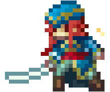

<div align='center'> 

<h1></h1> 

[](https://www.linkedin.com/in/jkcarney/)
[](https://twitter.com/joshcarney0)
[](https://jkcarney.github.io/)
[](https://www.dl.dropboxusercontent.com/s/pc1q5svtg448sn1/Joshua_Carney_Resume_2021_2022_NO_CONTACT.pdf?dl=0)



<code></code>
<code></code>
<code></code>
<code></code>
<code></code>
<code></code>
<code></code>
<code></code>
<code></code>

<br />

</div>


---


```java
public class Joshua extends MyParents {

    public Joshua() {
        String fullName = "Joshua Carney";
        String college = "Millersville University";
        Date expectedGradDate = new Date("May", 2022);

        String[] hobbies = new String[] {
            "game jams",
            "photography",
            "walking my dogs",
            "video games",
            "composing music"
        };

        String[] skills = new String[] {
            "object oriented programming",  // From education and internship
            "game programming and design",  // From game jams and courses
            "artificial intelligence",      // From independent study and courses
            "full-stack development",       // From internship
            "version control systems"       // From... everything
        };
    }
}
```
